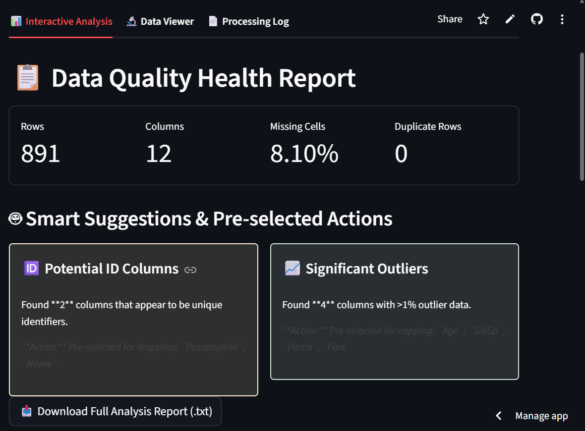
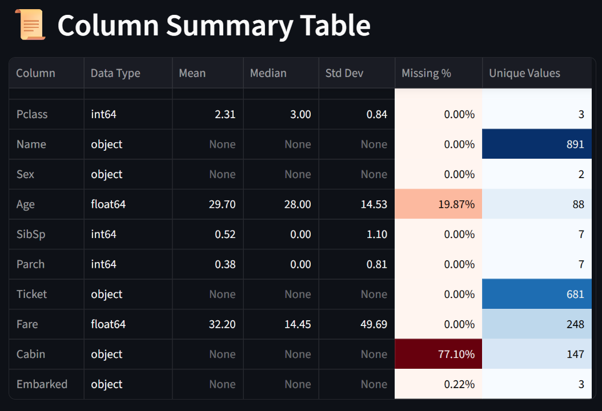
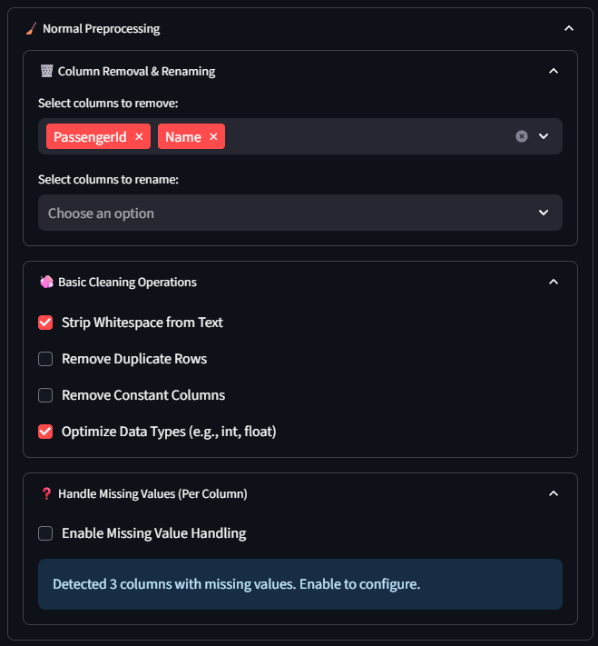
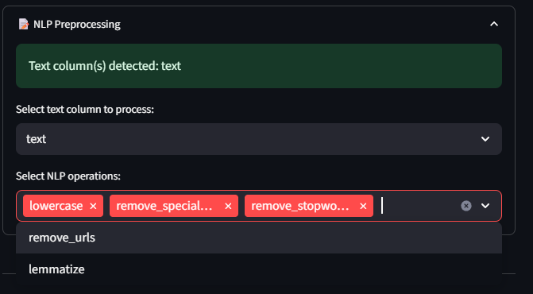
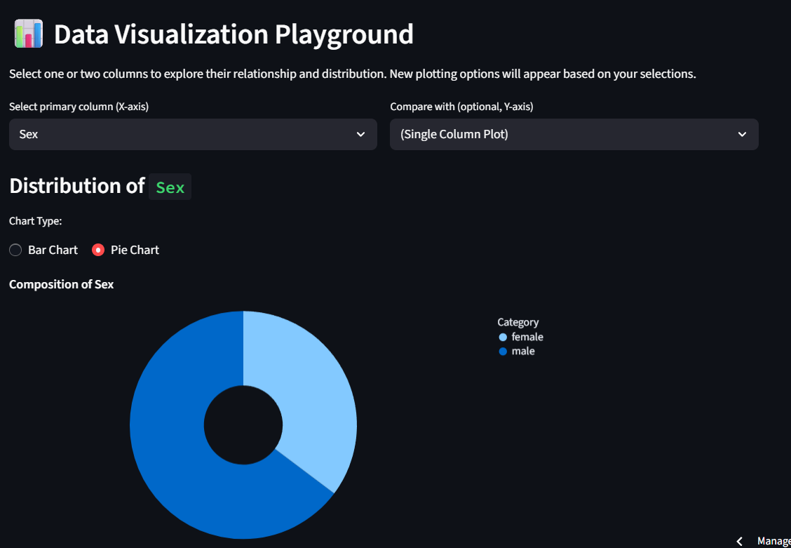
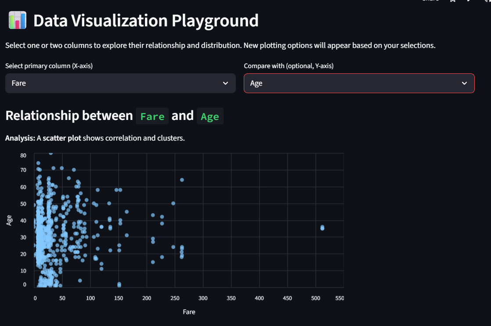
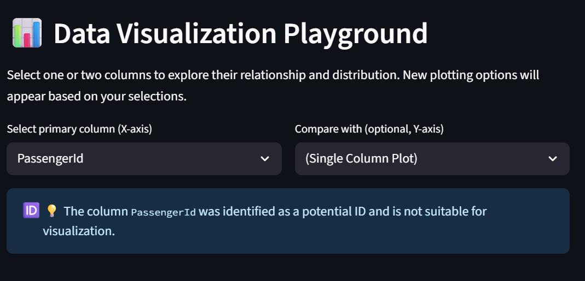
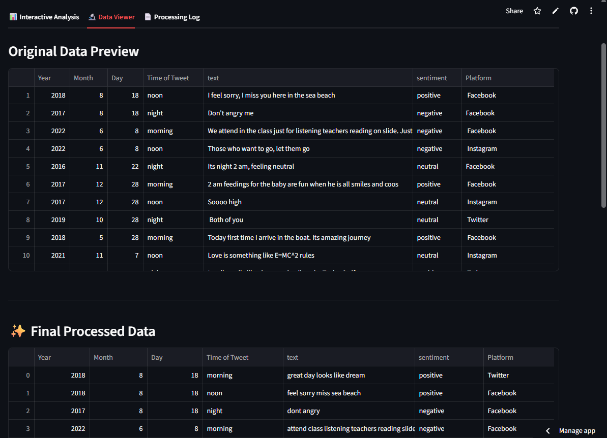
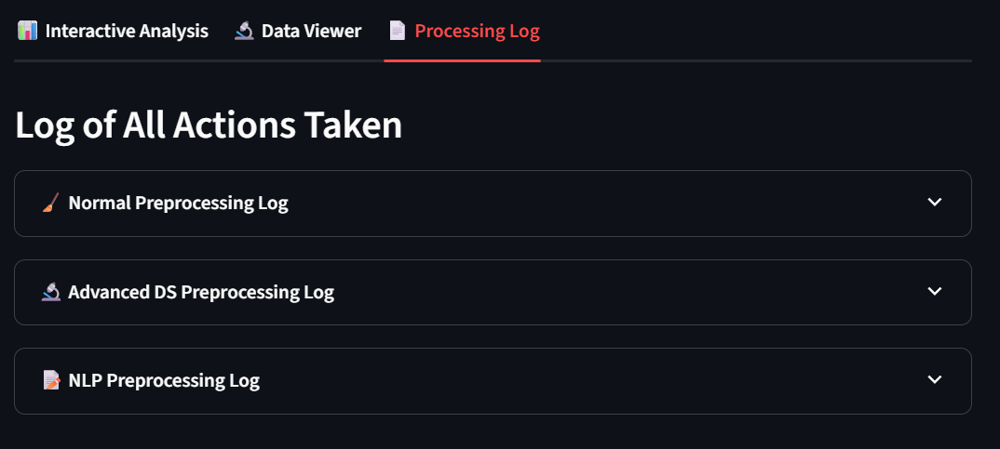

# ✨ The Intelligent Data Preprocessor

An interactive web application built with Streamlit that automates, simplifies, and accelerates the data cleaning and preprocessing workflow. This tool transforms a raw CSV file into a clean, analysis-ready dataset in minutes, not hours.

---

### **Quick Links**

🎥 **Watch the Demo Video on YouTube**
<br>
[](https://YOUR-YOUTUBE-LINK)

🌐 **Try the Live Application**
<br>
[**https://preprocess-your-data.streamlit.app/**](https://preprocess-your-data.streamlit.app/)

---

## 🎯 Project Goal

The primary goal of this project is to minimize the cognitive load on the data analyst. By performing a deep, automated analysis of the data, the application intelligently identifies common issues and suggests best-practice solutions. The user is then empowered to review, adjust, and execute a complex preprocessing pipeline with confidence and ease.

This tool is designed to be a perfect blend of **intelligent automation** and **manual user control**.

## 🚀 Key Features & Technical Logic

This application is more than just a wrapper around libraries; it contains a set of custom heuristics and logic to make intelligent, context-aware decisions.

-   **Intelligent Analysis Engine:** The application automatically performs a deep scan of the dataset to identify potential issues before any cleaning begins.

    <details>
    <summary><strong>🧠 Behind the Scenes: The Analysis Logic</strong></summary>
    
    The analysis engine doesn't just calculate basic statistics; it uses a series of rules to find actionable insights:
    -   **Potential ID Detection:** A column is flagged as a potential ID if it meets a two-part heuristic:
        1.  Its uniqueness ratio (`unique_values / total_rows`) is greater than 95%.
        2.  OR, its name contains a keyword like `id`, `no`, or `key`, and its uniqueness is still very high (>85%).
    -   **Outlier Detection:** Outliers are calculated using the standard **IQR (Interquartile Range)** method. However, to avoid incorrectly flagging discrete counts (like a 'Rating' column from 1-5), this check is **only performed on numeric columns with more than 20 unique values**, treating them as truly continuous data.
    -   **Highly Empty Column Detection:** Any column with more than **50% missing values** is flagged as "highly empty," as imputation is often not a viable strategy in such cases.
    -   **Correlation Analysis:** The Pearson correlation matrix is calculated for all continuous numeric columns, and any pair with a correlation coefficient **greater than 0.95** is flagged for potential multicollinearity.
    
    </details>

-   **Smart UI Defaults:** The control panel is automatically pre-configured based on the analysis, guiding the user toward best practices.

    <details>
    <summary><strong>⚙️ Behind the Scenes: The Pre-selection Logic</strong></summary>

    The "smart" part of the UI comes from mapping the analysis findings directly to the `default` parameters of the Streamlit widgets:
    -   The **"Columns to Remove"** multiselect is pre-populated with any columns flagged as **Potential IDs** and **Highly Empty Columns**.
    -   The **"Remove Constant Columns"** and **"Remove Duplicate Rows"** checkboxes are automatically ticked if the analysis finds them.
    -   The **"Enable Outlier Capping"** checkbox is automatically ticked, and the relevant columns are pre-selected in the multiselect if the analysis flags any significant outliers.
    -   **NLP options** are pre-selected based on a "best practice" baseline (lowercase, remove stopwords, etc.), with `remove_urls` being intelligently added only if URLs are detected in the text.
    
    </details>

-   **Advanced Interactive Visualizations:** A data exploration playground that automatically selects the best chart type and provides intelligent plotting options.

    <details>
    <summary><strong>📊 Behind the Scenes: The Visualization Logic</strong></summary>

    The playground avoids being just a simple plotting tool by incorporating contextual intelligence:
    -   **Plot Type Selection:** The logic for choosing a chart is nuanced:
        1.  A column is first classified as **"Continuous Numeric"** (numeric type with >20 unique values) or **"Categorical/Discrete"** (object type or numeric with <=20 unique values).
        2.  This classification then determines the plot:
            -   `Continuous` vs. `Continuous` -> **Scatter Plot**
            -   `Continuous` vs. `Categorical/Discrete` -> **Box Plot**
            -   `Categorical/Discrete` vs. `Categorical/Discrete` -> **Heatmap**
    -   **Intelligent Defaults:**
        -   **Histogram Bins:** The default number of bins is calculated using the robust **Freedman-Diaconis rule**, providing a better starting point than a fixed number.
        -   **Log Scale:** The "Use Log Scale" checkbox is automatically ticked for highly skewed data (skewness > 2), making skewed distributions instantly more readable.
        -   **High-Cardinality Plots:** For categorical columns with many unique values, the bar chart automatically groups less frequent categories into an **"Other"** bar to maintain readability.

    </details>

-   **Comprehensive Preprocessing Toolkit:** A wide range of options for normal cleaning, advanced data science transformations, and NLP text processing.

-   **Transparent Logging:** A detailed and attractive log of every action taken, providing a clear audit trail of the entire cleaning process.

---

## 📸 Application Showcase

*(This section remains the same as your version, with the centered and resized images)*
<p align="center">
  
</p>
<p align="center">
  
</p>
<p align="center">
  
</p>
<p align="center">
  
</p>
<p align="center">
  
</p>
<p align="center">
  
</p>
<p align="center">
  
</p>
<p align="center">
  
</p>
<p align="center">
  
</p>

---

## 🏁 Getting Started

To run this project locally, follow these steps:

1.  **Clone the repository:**
    ```bash
    git clone https://github.com/DarshitaDwivedii/Preprocess-Your-Data.git
    cd Preprocess-Your-Data
    ```

2.  **Create and activate a virtual environment:**
    ```bash
    python -m venv venv
    # On Windows
    venv\Scripts\activate
    # On macOS/Linux
    source venv/bin/activate
    ```

3.  **Install the required dependencies:**
    ```bash
    pip install -r requirements.txt
    ```

4.  **Run the Streamlit application:**
    ```bash
    streamlit run app.py
    ```

The application should now be open and running in your web browser.